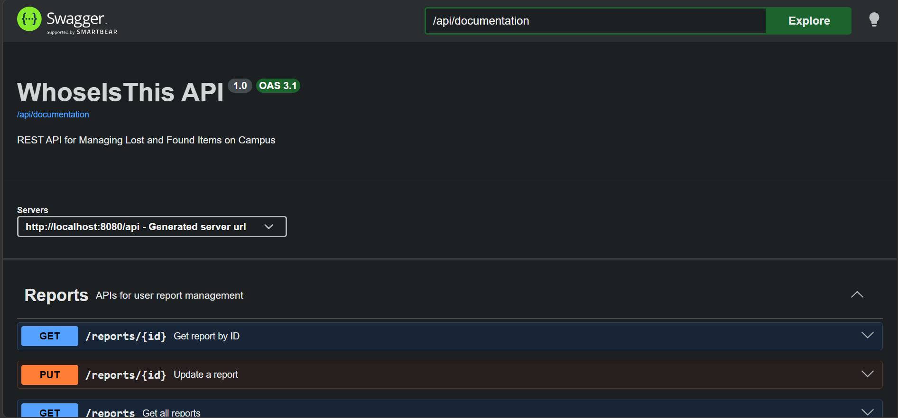

# 📌 WhoseIsThis API - REST API for Managing Lost and Found Items on Campus (Microservices)



## 📑 Table of Contents

- [Description](README.md#-description)
- [Microservices & System Design](README.md#-microservices--system-design)
- [Main Features](README.md#-main-features)
- [Technical Highlights](README.md#️-technical-highlights)
- [Tech Stack](README.md#️-tech-stack)
- [Installation](README.md#-installation)
- [License](README.md#-license)

## ✨ Description

WhoseIsThis API is a REST API for a campus lost-and-found reporting system. Users can report lost or found items, browse public reports, and allow administrators to moderate and verify reports manually.

## 💻 Microservices & System Design

- API Gateway pattern for external client communication

- Event-driven communication using Apache Kafka for asynchronous communication

- Database-per-service architecture to keep services loosely coupled

- Transactional Outbox Pattern for reliable event publishing

- Scheduled Outbox Worker that publishes pending events every second

- Automatic retry with Dead Letter Topic (DLT)

- Timestamp-based idempotent consumers to prevent stale event processing

- Event-driven denormalization for cross-service data synchronization

- Dockerized microservices environment using Docker Compose

## 🚀 Main Features

- Role-based access control (USER / ADMIN)

- Reports management (Lost & Found Items)

- User profile management

- Public report browsing with pagination & filtering

- Admin moderation system

## ⚙️ Technical Highlights

- Clean layered architecture (Controller → Service → Repository)

- JWT-based authentication with HTTP-only cookies

- Request logging using Web Filter

- Redis caching using Upstash Redis

- Rate limiting using Upstash Redis

- DTO-based API responses & validation

- Centralized exception handling

- Dockerized multi-service environment

- Testing using JUnit

## 🛠️ Tech Stack

| Component        | Technology                  |
| ---------------- | --------------------------- |
| Language         | Java 21                     |
| Framework        | Spring Boot                 |
| Message Broker   | Apache Kafka                |
| Containerization | Docker                      |
| Build Tool       | Gradle                      |
| Database         | PostgreSQL                  |
| ORM              | Spring Data JPA (Hibernate) |
| Cache            | Redis (Upstash)             |

## 📦 Installation

1.  Clone repository

    ```bash
    git clone https://github.com/rckyrcky/whoseisthis-api-microservices
    ```

2.  Go to project folder

    ```bash
    cd whoseisthis-api-microservices
    ```

3.  Create an .env file based on .env.example and fill in the required values

4.  Start all services

    ```bash
    docker compose -f docker-compose.dev.yml up -d
    ```

5.  Basic API documentation is available via Swagger UI for exploring available endpoints

    http://localhost:8080/api/docs

## 📜 License

This project is licensed under the MIT License - see the [LICENSE](LICENSE) file for details.

[Back to top](README.md#-whoseisthis-api---rest-api-for-managing-lost-and-found-items-on-campus-microservices)

© 2026 ricky | [ricky.rf.gd](https://ricky.rf.gd)
